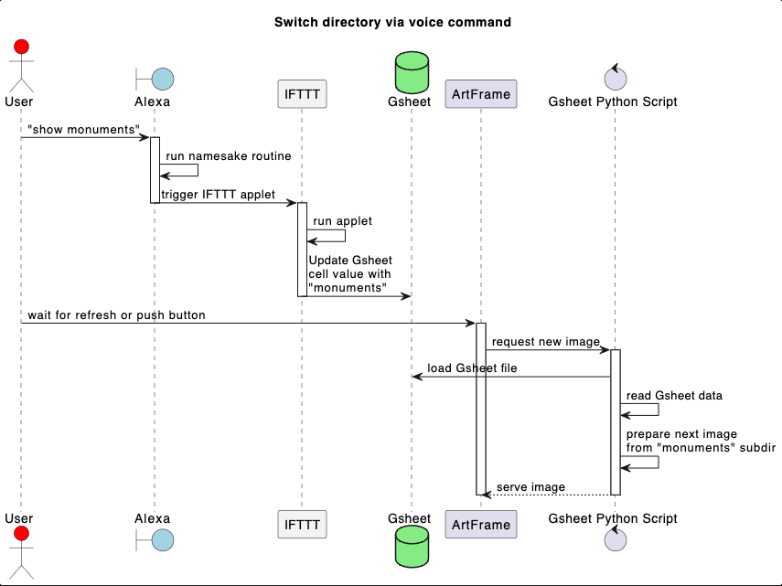

# Google Sheet directory Server switch

This tool serves arbitrary images to ArtFrame devices.

Supply the main path where you have other subdirectories of images sorted as per your preference that you want to be able to switch without restarting the server,
the preferred subdirectory will be read from a Google Sheet file hosted in your google account, this will allow you to use services as IFTTT and a voice assistant (Alexa/Google Home) to update the value in that cell using a custom routine, therefore updating the selected directory via voice command.



4 bit grayscale images with equal dimension to that of your ArtFrame display resolution are served as-is. All other images are resized, cropped to proper dimensions and converted to grayscale with 4 bit depth and dithering.

## Setup

Follow "Quickstart" guide for the [gsheets library](https://pypi.org/project/gsheets/), once you have the `client_secret.json` file from Google Dev Console place it in [this directory](./).

Then copy or rename [gsheet_config-sample.py](./gsheet_config-sample.py) to `gsheet_config.py` and put there the ID and cell where to find the subdirectory selected name

## Usage

1. Run ```./gsheet_switch.py [path to main directory]```

## Help

```
gsheet_switch.py [-h] [--port PORT] [path]

positional arguments:
  path                  folder that contains the other sub directories to be served (default: .)

optional arguments:
  -h, --help            show this help message and exit
  --port PORT, -p PORT  port that the server will listen on (default: 8090)
```
